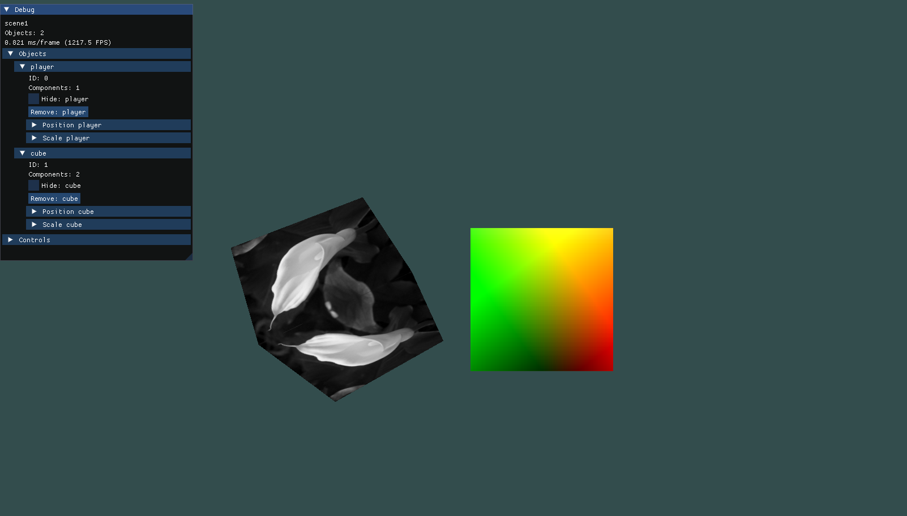

# C++ OpenGL Game Engine
# Build Instructions
Open the visual studio solution and select build. include and lib folder should be pre-linked and using the relative folder structure.

# Features:
- Easy To Use Debug GUI, allowing for manipulation of scene objects.
- Simple Entity Component System, allowing developers to implement gameplay faster.
- Render Objects with Textures through a simple renderer.

# Dependencies
- GLFW
- STB
- GLM
- ASSIMP
- Dear ImGui

# Gameplay Examples
In Application

# Renderer Changes
The renderer for the project has been modified to allow the object to determine how it is going to be rendered in the scene.
Each object now contains its own model and shader which it then renders in its own update loop determined by the type of object.

# Shaders
Multiple example shaders have been included to allow the user to edit the scene in any way they deem neccessary.

The two main shaders being:
- Object Shader (Unlit Texture)
- Normals Shader (Normal Mapped Lit Texture)

Another basic lit shader is included for usage on the cube example model

# Model Loading
Assimp is utilised to load the models included in the model directory of the project.
A scene is loaded from a .obj file. This is also where the vertex and mesh data are taken from and used to build a model object.    

# Skybox/Skybox Shader

# Example Usage

# Evaluation